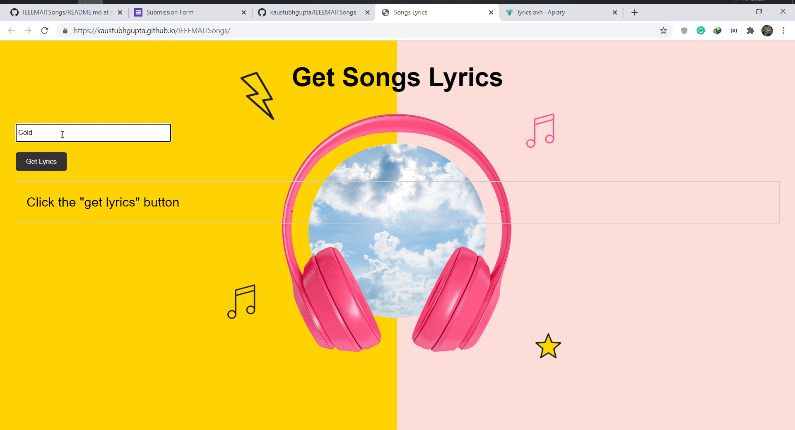

# IEEEMAITSongs 🎵🎼

## About 💪
This is a very basic approach to get the lyrics of the song provided the artist's name and title of the song. The API request is made using Python scripts running on the front end. The Python script is running with the help of Brython. 

## Related Articles 📃
[Run Python Code on Websites: Exploring Brython](https://towardsdatascience.com/run-python-code-on-websites-exploring-brython-83c43fb7ac5f)

## Website Link 😁 
[Song Lyrics Fetcher](https://kaustubhgupta.github.io/IEEEMAITSongs/)

## Preview 📺

# Tech Stack

- Brython: Handling the API calls 
- HTML: Basic web structure
- CSS: Some refining
- Github pages: For deployment purposes making it working 24x7!
- Lyrics API: Which returns the results
